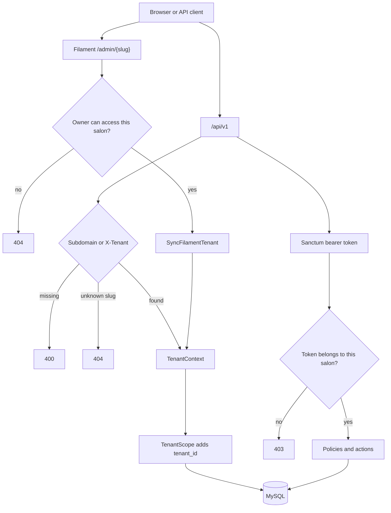

# SalonDesk

Multi-tenant appointment booking for salons, beauty studios, and other service businesses.

A salon signs up, adds services and staff, publishes a booking link, and takes appointments without double-booking a chair. Owners run the business from a Filament panel. The public API is what a website, a mini program, or a front desk would call. An assistant turns “a haircut with Anna next Tuesday afternoon” into a real open slot.

This repository is the foundation of that product: tenant isolation, the booking engine, a versioned API, roles, subscription plans, and the assistant boundary. It is built to be read as much as it is built to run.

[](https://github.com/z18666607076-tech/salondesk/actions/workflows/ci.yml)
[](https://www.php.net/)
[](https://laravel.com/)
[](LICENSE)

## Problem

Independent salons still run bookings in chat threads and shared spreadsheets. A vertical SaaS has to keep those businesses on one platform without ever mixing their calendars, their staff, or their invoices. The interesting problems are not the CRUD screens. They are conflict-free slots, a cancellation policy, a plan that limits how many stylists a salon can add, and an assistant that is not allowed to invent a time.

## Features

- Tenants are businesses. Data is isolated by `tenant_id` in one MySQL database. See [ADR 0001](docs/adr/0001-tenancy-strategy.md).
- Services carry a duration and a price. Staff have weekly working hours. Slots stay inside the shift, on the salon's interval, and never overlap a confirmed or completed visit.
- Public API under `/api/v1`: services, staff, availability, book, cancel, and reschedule. Cancel and reschedule require the customer email used at booking.
- Sanctum tokens for staff. A token from one salon gets **403** on another salon's API, not a silent empty list.
- Filament admin at `/admin/{slug}` with owner and staff roles. Staff see their own appointments. Owners manage the salon, the plan, and every visit.
- Stripe subscriptions through Laravel Cashier, one billable customer per salon. `BILLING_DRIVER=fake` writes Cashier rows and needs no API keys. Set the driver to `stripe` and add test-mode keys when you want Checkout.
- Booking assistant behind `BookingAssistant`. The fake driver is the default and is what tests use. The Laravel AI SDK driver runs only when `AI_BOOKING_DRIVER=laravel` and `OPENAI_API_KEY` is set, and it still has to match a slot the booking engine would return.
- Booking confirmation mail, queued on the `notifications` queue.

## Architecture



The full walkthrough is in [docs/architecture.md](docs/architecture.md).

| Piece | Choice |
| --- | --- |
| Tenancy | Single database, `tenant_id`, global scope. Not a database-per-tenant package. |
| Plans | Basic: 3 staff, no assistant. Pro: unlimited staff and the assistant. A generic trial counts as Pro. |
| Time | Stored in UTC. Shifts and “afternoon” use the tenant timezone (`Asia/Singapore` in the demo). |
| Assistant | Interface plus a fake driver. The SDK path is a tool-using agent whose proposal is checked against `CalculateAvailability`. |
| Billing | Cashier on the `Tenant` model. Fake driver in tests and in the default Compose file. |

## Tech stack

| | |
| --- | --- |
| PHP | 8.4 |
| Laravel | 13.34 |
| MySQL | 8.4 |
| Redis | 7 |
| Admin | Filament 5 |
| API auth | Sanctum 4 |
| Roles | spatie/laravel-permission 8, teams enabled |
| Billing | Laravel Cashier 16 (Stripe API `2025-06-30.basil`) |
| Assistant | laravel/ai 1 |
| HTTP docs | Scramble, at `/docs/api` |
| Tests | Pest 5, PHPUnit 13 |
| Style and types | Pint, Larastan level 6 |
| Local mail | Mailpit |

Versions above match `composer.lock`.

## Quick start

Docker Compose is the path that matches CI: PHP 8.4, MySQL 8.4, Redis 7, Mailpit, and a queue worker.

```bash
docker compose up -d --build
```

- App: http://localhost:8000
- Admin: http://localhost:8000/admin
- API docs: http://localhost:8000/docs/api
- Mailpit: http://localhost:8025
- Health: http://localhost:8000/up

The app container migrates, seeds, and publishes Filament assets on boot. The Compose `APP_KEY` is a local demo key. Do not reuse it anywhere else.

### Without Docker

You need PHP 8.4, Composer, MySQL 8, and Redis.

```bash
cp .env.example .env
composer install
php artisan key:generate
# create the salondesk database and the salondesk user from .env.example
php artisan migrate --seed
php artisan filament:assets
php artisan serve
php artisan queue:work redis --queue=notifications,default
```

Create a second database named `salondesk_testing` and grant the same user access before running the test suite. `phpunit.xml` points at it.

## Demo credentials

Every seeded password is `password`.

| Salon | Plan | Who | Email | API header |
| --- | --- | --- | --- | --- |
| Glow Studio | Pro trial, 14 days | Owner Maya Tan | `maya@glow-studio.test` | `X-Tenant: glow-studio` |
| Glow Studio | | Stylist Anna Chen | `anna@glow-studio.test` | |
| Glow Studio | | Stylist Ben Ong | `ben@glow-studio.test` | |
| Northshore Nails | Basic | Owner Lina Koh | `lina@northshore-nails.test` | `X-Tenant: northshore-nails` |
| Northshore Nails | | Staff Noor Idris | `noor@northshore-nails.test` | |

Glow Studio has Haircut (45 min, SGD 48.00), Color, and Blowdry. Anna works Monday–Saturday 10:00–19:00. Priya Shah already has a Haircut next Monday at 10:00 with Anna.

Admin URLs: `/admin/glow-studio` and `/admin/northshore-nails`. Opening the other salon's URL returns 404.

```bash
curl -s -H 'X-Tenant: glow-studio' -H 'Accept: application/json' \
  'http://localhost:8000/api/v1/availability?service_id=1&date=2026-10-06&staff_id=2&time_of_day=afternoon'
```

`service_id` and `staff_id` come from `/api/v1/services` and `/api/v1/staff`.

Log in as Maya, then ask the assistant:

```bash
curl -s -H 'X-Tenant: glow-studio' -H 'Accept: application/json' \
  -H "Authorization: Bearer $TOKEN" \
  -H 'Content-Type: application/json' \
  -d '{"message":"a haircut with Anna next Tuesday afternoon"}' \
  http://localhost:8000/api/v1/assistant/bookings
```

Northshore Nails is on Basic, so the same call returns 403.

## Tests

```bash
composer test
vendor/bin/pint --test
vendor/bin/phpstan analyse --memory-limit=1G --no-progress
```

Inside Compose: `make test`, `make lint`, `make analyse`.

Pest covers:

- no cross-tenant reads by query, by id, or by another salon's Sanctum token
- afternoon slots, double-booking, cancel, reschedule, and the staff cancellation rule
- the Basic staff cap
- fake Cashier activation and a signed webhook
- the assistant proposal, including the Laravel AI SDK path with `BookingAgent::fake()`
- queued confirmation mail
- Filament tenant pages
- the OpenAPI document

GitHub Actions runs Pint, Larastan, and Pest against MySQL 8.4 and Redis 7.

## Configuration

| Variable | Default | Purpose |
| --- | --- | --- |
| `TENANT_BASE_DOMAIN` | `salondesk.test` | `{slug}.{domain}` selects the tenant |
| `BILLING_DRIVER` | `fake` | `fake` or `stripe` |
| `AI_BOOKING_DRIVER` | `fake` | `fake`, or `laravel` when `OPENAI_API_KEY` is set |
| `STRIPE_PRICE_BASIC` / `STRIPE_PRICE_PRO` | `price_fake_*` | Cashier price ids |
| `CASHIER_CURRENCY` | `sgd` | |
| `OPENAI_API_KEY` | empty | Required only for the live assistant |

Leave Stripe and OpenAI blank. The app boots and the tests pass without them. Never commit live keys.

## Roadmap

The foundation deliberately stops before a full product surface.

- Receptionist role, with a calendar that can book any stylist in the salon
- Customer accounts and a hosted booking page, not only the JSON API
- Localisation and a currency per salon at checkout, not only on the service
- Laravel Reverb for a live day-view in the panel
- Feature flags with Laravel Pennant for plan experiments
- An MCP server in front of the same assistant tools
- A WeChat mini program that talks to `/api/v1`

## License

MIT. See [LICENSE](LICENSE).
