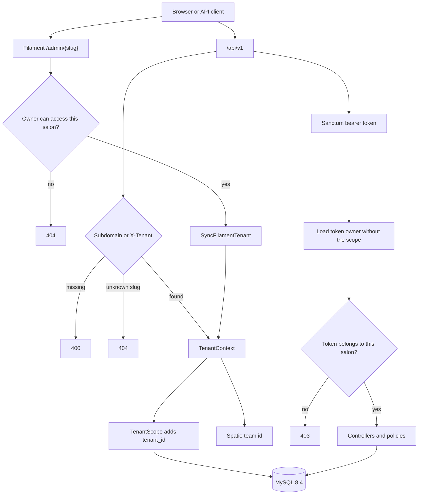

# Architecture

SalonDesk is a Laravel monolith. One deployable serves the public booking API, the Filament admin panel, Stripe billing, and the booking assistant.

## Request path

## Booking

`CalculateAvailability` walks each bookable staff member's shift for the requested local date. Slots start on the shift, step by `slot_interval_minutes` (15 by default), and must finish before the shift ends. A slot is returned only when it is still in the future and does not overlap a confirmed or completed appointment. Cancelled visits free the time.

`BookAppointment` locks the service, the staff row, and overlapping appointments, then writes the visit. Cancel and reschedule from the public API require the customer email that was used to book. Staff cancel and reschedule go through policies: a stylist can change only their own visits, and an owner can bypass the cancellation window. The window defaults to two hours. A visit that has already started cannot be moved.

Times are stored in UTC. Working hours and phrases such as "afternoon" (12:00–16:59) are interpreted in the tenant timezone. The demo salons use `Asia/Singapore`.

## Billing

`BILLING_DRIVER=fake` writes Cashier `subscriptions` and `subscription_items` rows and never calls Stripe. `BILLING_DRIVER=stripe` with `STRIPE_SECRET` opens a Cashier Checkout session. The webhook is Cashier's controller at `POST /api/v1/billing/webhook` and is excluded from tenant identification. No Stripe secret is committed. Tests sign a webhook with the placeholder configured in `phpunit.xml`.

## Assistant

`App\Ai\Contracts\BookingAssistant` is the only type controllers depend on. `FakeBookingAssistant` is the default. It is also selected when `AI_BOOKING_DRIVER` is not `laravel` or `OPENAI_API_KEY` is empty. The fake driver matches service and staff names, a weekday, and a part of day, then asks `CalculateAvailability` for a real slot.

`LaravelAiBookingAssistant` uses the official `laravel/ai` SDK. `BookingAgent` is promptable, has tools (`ListServicesTool`, `ListStaffTool`, `SearchSlotsTool`), and returns structured `service_id`, `staff_id`, and `starts_at`. The assistant accepts that proposal only when the same slot exists in the booking engine. Confirming the proposal books it with source `ai`. The Basic plan receives 403.

## Mail

`BookAppointment` dispatches `SendAppointmentConfirmation` onto the `notifications` queue. The job sends `AppointmentConfirmed` as mail. Tests use the sync queue. Docker Compose runs a worker on Redis and Mailpit on port 8025.

## Admin

The `admin` panel is tenant-aware. Resources cover services, staff, weekly schedules, customers, and appointments. Creating an appointment calls `BookAppointment`. Changing the start time calls `RescheduleAppointment`. Owners manage billing from the panel; the fake driver activates a plan in place, and the Stripe driver redirects to Checkout.
